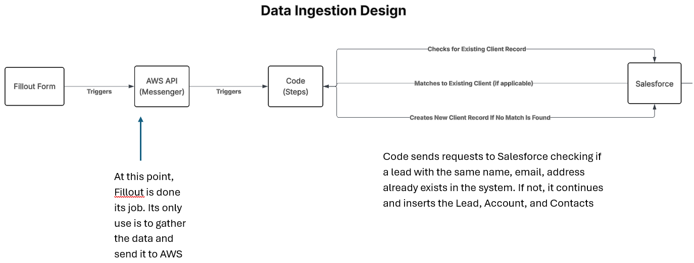
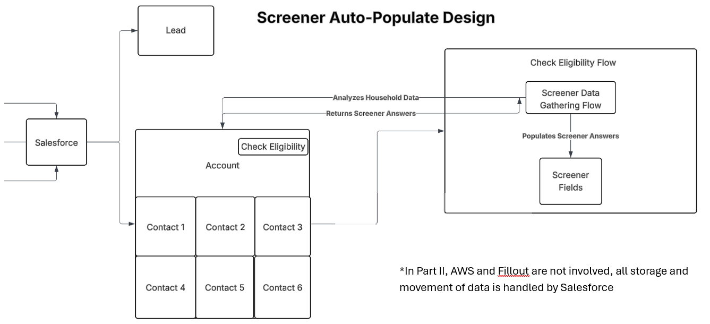

# FilloutSalesforceIntegration
## Background and Impact
This integation connects Fillout form submissions to the Salesforce to automatically create Leads, Accounts, and Contacts when a potential client submits their Fillout intake form. This reduces the need for the counselors to perform manual data entry and maintains data integrity.

I designed and implemented this while working at a non-profit. Our counselors would help residents apply for public benefits. On top of completing the application, counselors would have to complete a significant amount of data entry in Salesforce so our grantor could keep track of the applications and make sure we met our contract requirements. I had already transformed our data intake from paper to digital forms using Fillout.com, and saw an opportunity to reduce data entry and save the counselors time. I pitched this to the grantor and they let me implement it in their Salesforce Sandbox, but I ended up switching to a new company before we every got it into production.

For each new household, counselors would have to manually enter:
- A Lead (12 fields)
- A Screener (25-36 fields)
- A Contact (12 fields) for each family member

This integration would automate the entry of:
- All 12 Lead Fields
- All 12 Contact fields per family member
- 18 of the Screener fields (when paired with a Salesforce flow)

| Scenario | # of Manually Entered Fields (w/o integration) | # of Manual Entered Fields (w/ integration) | Reduction % |
|----------|------------------------------------------------|----------------------------------------------|-------------|
| Household of 1 (homeless) | 49 | 7 | 86% |
| Household of 3 (renting) | 76 | 10 | 87% |
| Household of 6 (homeowner) | 115 | 13 | 89% |


Many agencies already use digital forms to collect clients' intake data. Rather than requiring counselors to read through client submissions and manually their answers into the Salesforce, this integration allows clients to send their data into the Salesforce without ever directly interacting with the system.

By having the Lead, Account, and Contacts created instantly when a client requests services, counselors can simply search for their Account at appointment time. Once found, the counselor can click "Check Eligibility" and a Salesforce Flow can pre-populate most of the Screener fields using the data in the Account and Contacts. This allows counselors to quickly determine eligibility of their clients for public benefits programs and move on to filling out those applications.

## Pre-Requisites
\* Every pre-requisite is free (or at least provides a limited free version), except for the AWS Secrets. This integration requires three secrets, which each cost ~$2.50 per month to store in AWS
1. Fillout
    - A Fillout account
    - A Fillout API key
2. Salesforce
    - System Administrator access with Setup permissions
    - An External Client App, private key, and certificate for OAuth JWT authentication
3. Amazon Web Services (AWS)
    - An AWS Account
    - Access to Secrets Manager, Lambda, and API Gateway (also ideally access to CloudWatch logs for debugging)

## Key Components
1. Webhook Setup
    - A Fillout webhook is created and points to an AWS POST API endpoint
    - The webhook sends JSON payloads of form submissions to the endpoint
2. API Trigger
    - When the webhook fires, it triggers an AWS Lambda function containing the integration code
3. Form Processing
    - index.mjs calls formProcessor.js, which orchestrates the process
    - formProcessor.js first calls fillout.js to parse the form submission and group the fields required for each Salesforce record
4. Duplicate Check
    - formProcessor.js uses client.js functions to query Salesforce for an existing Lead that meets the duplicate rule (matching First Name, Last Name, and Email Address)
    - If a matching Lead exists, the lambda handler stops and no new records are created
5. Record Creation
    - If there is no matching Lead, formProcessor.js creates:
        - A Lead
        - An Account
        - A Contact for each family member
6. PDF Upload
    - Finally, formProcessor.js uploads the pdf intake form (created and retrieved Fillout) to the Lead and the Account

## Security
- Authentication & Authorization: Integration uses JWT-based OAuth 2.0 to authenticate to Salesforce; no passwords are stored or transmitted; access is granted through certificate-base cryptographic verification
- Webhook Protection: All incoming webhook requests require a shared secret, validated by Lambda.
- Transport Security: All data is transmitted over HTTPS to protect PII and prevent tampering.
- Secrets Management: AWS Secrets Manager stores all sensitive credentials (private key, client ID, webhook secret), accessed only by the Lambda function using least-privilege
IAM roles.

## Multiple Language Normalization
The next step would be making this integration able to handle Fillout submissions in multiple languages. Fillout offers form translations on the Business Plan ($89/month) so that users can pick their preferred language from a dropdown field and all questions and multiple-choice options will be translated. I haven't upgraded to Fillout Business so I can't test out this normalizatoin yet, but Fillout support was nice enough to test out how translations affect the JSON Payload for me. When a client changes the language, each question's id and name stays the same, but multiple choice values come in the client's selected language in the JSON payload. Since the Salesforce picklist options are all in English, all picklist values must be normalized to canonical values that can be mapped to the Salesforce picklist values. I added the normalization code to handle these changes, but I still would need to upgrade to Business to complete the maps for each language and test this out.

Example: One question with same answer but different language selected
```json
{
    "id": "7pZQ",
    "name": "Highest Education Completed",
    "type": "Dropdown",
    "value": "Bob"
}
{
    "id": "7pZQ",
    "name": "Highest Education Completed",
    "type": "Dropdown",
    "value": "Graduado de Secundaria"
}
{
    "id": "7pZQ",
    "name": "Highest Education Completed",
    "type": "Dropdown",
    "value": "Tốt Nghiệp Trung Học"
}
```

## Secrets
There are three secrets necessary\
When creating each secret, use "Other type of secret"
1. Salesforce External App Credentials
    - Type: Key/value
    - Pairs:
        - username: the username of a system administrator in your Salesforce org
        - loginUrl: the URL that you normally use to login to your Salesforce org
        - consumerKey: the consumer key of your External Client App
            - Can be found by navigating to Setup --> External Client App Manager --> Click on your app --> Settings --> OAuth Settings --> App Settings --> Consumer Key and Secret
2. Salesforce Private Key:
    - Type: Plaintext
    - Just paste in server.key text exactly as it appears in Notepad
3. Fillout API Key
    - Type: Key/value
    - Pairs:
        - fillout-api: paste the API key you created in Fillout
        - webhook-secret: paste the webhook secret you generated

## System Diagrams
### Data Ingestion Design
This is where the integration code is utilized to parse the Fillout submission and create objects in Salesforce



### Screener Auto-Populate Design
After this integration code has created the Lead, Account, and Contacts, a Salesforce flow can use the data to auto-populate the Screener fields



## Troubleshooting / Common Errors
### OAuth Error: `invalid_grant`
```json
data:
    {
        error: 'invalid_grant',
        error_description: "user hasn't approved this consumer"
    }
```

**Cause:**
The External Client App's Permitted Users policy is set to "All users can self-authorize"

**Solution:**
1. Navigate to Setup --> External Client App Manager --> Click on your External Client App
2. Under OAuth Policies --> Plugin Policies --> Permitted Users
3. Make sure it is set to "Admin users are pre-approved"
4. Navigate to App Policies --> Select Profiles
5. Select System Administrator (make sure the username you put in the API credentials is set to System Administrator)

### OAuth Error: `External client app is not installed in this org`
```json
data:
    {
      error: 'app_not_found',
      error_description: 'External client app is not installed in this org'
    }
```
**Cause:**
The loginUrl provided in the Salesforce credentials secret is wrong

**Solution:**
Verify the loginURL is exactly the same URL you use to manually login

### Picklist Error `bad value for restricted picklist field`
```json
{
    message: 'Race: bad value for restricted picklist field: Native American / Alaskan Native',
    errorCode: 'INVALID_OR_NULL_FOR_RESTRICTED_PICKLIST',
    fields: [ 'Race__c' ]
}
```

**Cause**
One of the picklist values in the Fillout form does not match a picklist option for the corresponding Salesforce field

**Solution**
1. Go into Setup --> Object Manager --> The object that the field belongs to
2. On the left hand bar, click "Fields and Relationships"
3. Click on the field that the Fillout question pertains to
4. Verify that the picklist values at the bottom of the page exactly match the options in the Fillout picklist

### Picklist Error `No such column 'ColumnName' on sobject of type Object`
```json
{
    message: "No such column 'GenderIdentity' on sobject of type Contact",
    errorCode: 'INVALID_FIELD'
}
```

**Cause**
Trying to create a Salesforce object but using a field name that doesn't exist

**Solution**
1. Go into Setup --> Object Manager --> The object that the field belongs to
2. On the left hand bar, click "Fields and Relationships"
3. Verify that all fields listed in the axios API call match one of the values under "FIELD NAME"

## Example JSON Payload
```json
{
    "formId": "eLypJ5H8Hyus",
    "formName": "Salesforce Integration (English)",
    "submission": {
        "submissionId": "296958d1-1695-4d97-888f-9c80454e0fb4",
        "submissionTime": "2026-02-09T13:59:12.300Z",
        "lastUpdatedAt": "2026-02-09T13:59:12.300Z",
        "questions": [
            {
                "id": "hiTj",
                "name": "First Name",
                "type": "ShortAnswer",
                "value": "Bob"
            },
            {
                "id": "cdfp",
                "name": "Last Name",
                "type": "ShortAnswer",
                "value": "West"
            },
            {
                "id": "rfop",
                "name": "Email",
                "type": "EmailInput",
                "value": "mquigs00@gmail.com"
            },
        ]
    }
}
```

## References
- Fillout
    - [Create a Fillout API Key](https://www.fillout.com/help/fillout-rest-api)
    - [Create a Fillout Webhook](https://www.fillout.com/help/api-reference/create-a-webhook)
- Salesforce
    - [Create an External Client App](https://help.salesforce.com/s/articleView?id=xcloud.create_a_local_external_client_app.htm&type=5)
    - [Configure a JWT Bearer Flow](https://help.salesforce.com/s/articleView?id=xcloud.configure_oauth_jwt_flow_external_client_apps.htm&type=5)
- AWS
    - [Setup an HTTP POST API to Trigger a Lambda Function](https://docs.aws.amazon.com/apigateway/latest/developerguide/http-api-develop.html)